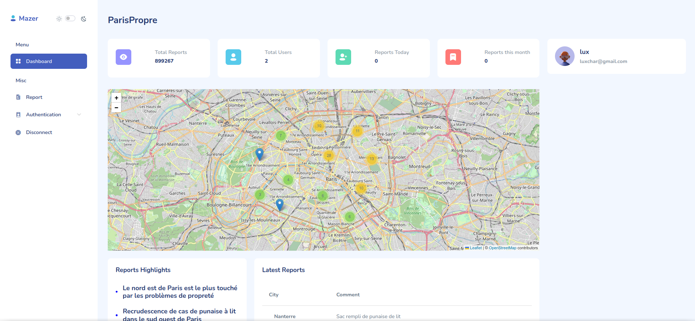

<h1 align="center">ParisPropre</h1>



# Table of content

- [Introduction](#introduction)
- [Installation](#installation)
- [Usage](#usage)
- [Contributing](#contributing)
- [License](#license)

## Introduction
ParisPropre is a project done under 3 days making use of the [data](https://opendata.paris.fr/pages/home/) Paris makes public about its streets and their cleanliness. The goal of this project is to make a website that allows users to see the cleanliness of the streets of Paris and to report any problems they see on the streets.

## Installation
Make sure you have installed **typescript** on your system and **npm**, then head over to the root of the project and type ```npm i```

In order to run the API you need to install the dependencies in the api folder, so head over to the api folder and type ```npm i```
<br>
You **need** to create a .env file and add the mongodb tokens

**Example:**
```
MONGO_URL=mongodb+srv://<USERNAME>:<PASSWORD>@x
MONGO_USERNAME=x
MONGO_PASSWORD=x

BASE_URI=x (optional)
```
<br>
If you have any problems with the installation, you can open an issue in this repository.

## Usage
Run ```npm start``` in /API to run the API and ```npm run dev``` in the root of the project to run the website.

## Contributing
If you want to contribute to this project you can fork this repository and make a pull request with your changes.
Anyone is welcome to contribute to this project.

## License
This project is under the MIT license.
